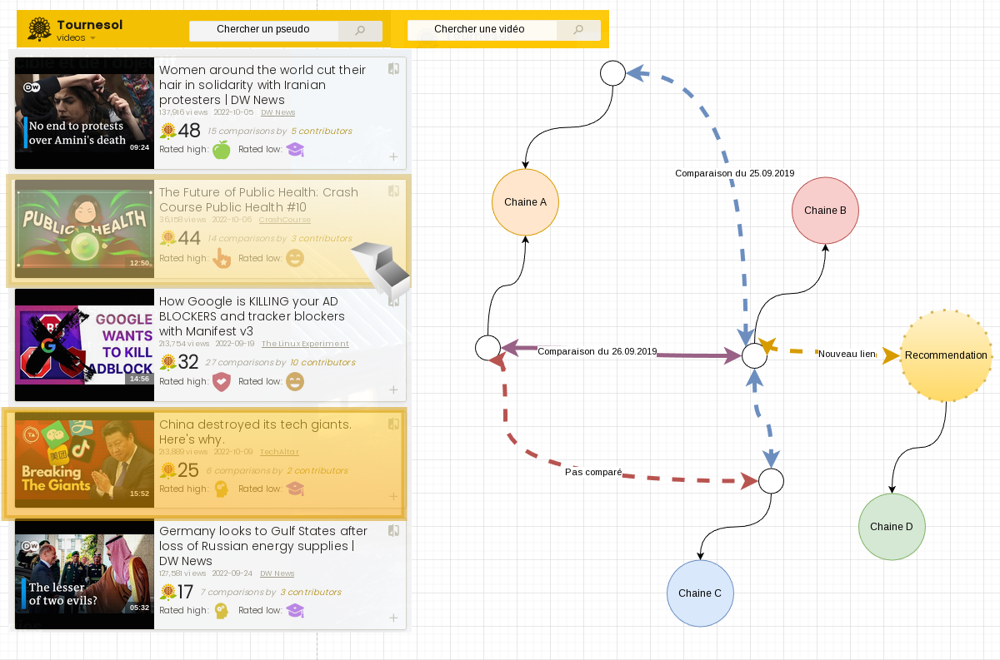
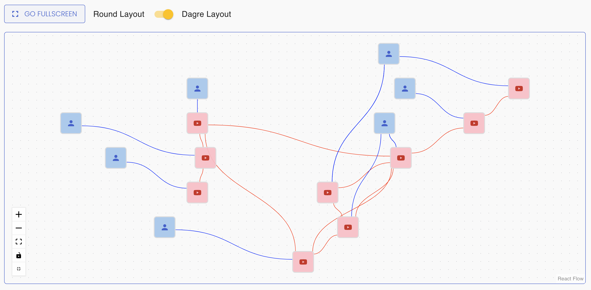
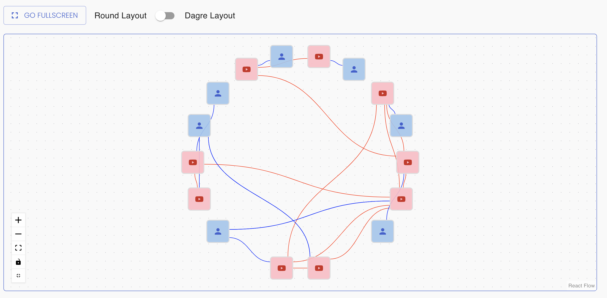
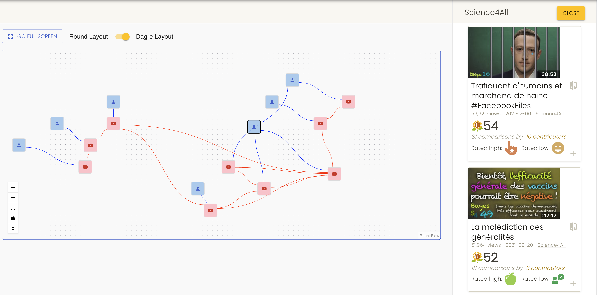
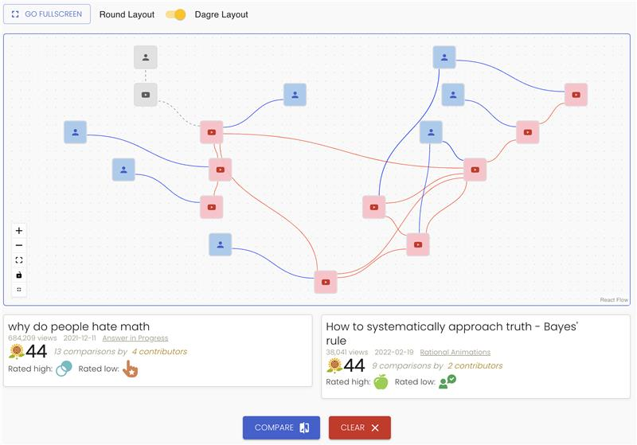

# Projet de MA-VI

This is an academic project for the "Visualization" course from MSE HES-SO.
It aims to contribute to the Tournesol project by providing an interactive view
of user data and comparisons.

The contribution will be made at the end of the project by selecting what's
worth keeping and sharing with the Tournesol team.

The following is written in french as it is only relevant to our course.

### Guide de démarrage rapide

Pré-requis : avoir installé docker et docker-compose

1. Cloner le projet `git clone https://github.com/MSE-VI/tournesol.git`
2. Se rendre dans le dossier du projet : `cd tournesol`
3. Initialiser l'environnement de développement : `./dev-env/run-docker-compose.sh`
   - Attendre quelques minutes que le script se termine
   - Selon les performances de la machine, un message d'erreur indique qu'un composant n'a pas pu démarrer. Il suffit d'attendre quelques minutes supplémentaires
4. Facultatif : Il est possible d'obtenir la dernière version de la base de données en exécutant `./dev-env/run-docker-compose.sh download`
5. Se connecter à l'application web [http://localhost:3000](http://localhost:3000)
   - Utiliser l'utilisateur `user` ou `user1` et le mot de passe `tournesol`

### Thématique / source de données

Contribuer au projet Tournesol et proposant une visualisation interactive et intéressante de leurs données.

Le choix de la source des données est induite par le choix du projet : nous utilisons la base de données de la plateforme Tournesol.

### Définition du public cible et de l'objectif

**Idée générale :** Stimuler le nombre de contributions des utilisateurs du projet.

**Public cible:** Personne inscrite à la plateforme n'ayant que peu contribué

**Intention/objectif:** Présenter une visualisation qui a besoin de plusieurs comparaisons pour être intéressante. Ce qui augmente le nombre de comparaison à faire pour tester et crée un sentiment d'accomplissement. 

### Choix de la représentation

Nous avons choisis de représenter l'évolution de la contribution de l'utilisateur via le graphe des comparaisons effectuées. Il y a deux raisons principales :

- Les contributions sont des comparaisons et donc des liens entre des objets sont naturellement représentables par un graphe
- Un graphe vide ou peu rempli crée un sentiment d'insatisfaction

### Maquette - texte en l'état par rapport aux réflexions initiales

L'utilisateur peut chercher un pseudo pour changer le "point de vue" de l'affichage.

Une liste de vidéos recommandées à comparer est affichée sur la gauche. Des vidéos spécifiques peuvent être ajoutées via le champs de recherche en haut. En sélectionnant une vidéo à gauche, la vue de droite se déplace pour la centrer. En sélectionnant une deuxième vidéo, la vue de droite ajoute un lien entre elles et recentre la vue sur le lien. Le zoom est aussi ajusté lors des déplacements de la vue.

Sur la partie de droite, on peut voir l'historique des comparaisons faites par l'utilisateur sélectionné (à l'aide de son pseudo). Cette vue représente les comparaisons entres les vidéos sous la forme de liens. Les recommandations sont ajoutées pour permettre de d'apprécier l'apport potentiel d'une contribution. En sélectionnant une vidéo ou un lien dans la vue de droite, les vidéos associées à gauche sont aussi sélectionnées. Les liens existants entre deux vidéos déjà comparées de manière isolée (et donc déjà visionnées et faciles à comparer) sont aussi présentées. Un code couleur permet de rapidement différencier une comparaison déjà effectuée d'un lien auquel on peut contribuer.

### Choix des technologies

- [react](https://reactjs.org/): ajout d'une page au frontend existant
- [reactflow](https://reactflow.dev/): affichage du graph des comparaisons

### Présentation et interaction

Les vues suivantes sont tirées de la page que nous avons ajouté au frontend de Tournesol.
Par soucis de lisibilité, nous ne présentons que le graphe lui-même et non l'interface entière.

#### Graphe de base

La vue de base consiste à afficher le graphe des comparaisons effectuées par l'utilisateur actuellement connecté. En d'autres termes, on y voit les contributions à Tournesol.

#### Deuxième type d'affichage

Selon les comparaisons effectuées l'algorithme de placement des noeuds par défaut peut donner un résultat peu lisible. C'est pour cela qu'un deuxième type de disposition a été ajouté.

#### Exploration de chaîne

Afin de permettre à l'utilisateur d'étendre son graphe à partir d'une chaîne Youtube spécifique, une interaction a été ajoutée. Lorsque l'utilisateur sélectionne une chaîne sur le graphe, un panneau latéral apparait et permet de facilement démarrer la comparaison d'une vidéo.

#### Extension efficace du graphe

L'API de Tournesol propose de fournir une suggestion de comparaison a effectuer pour maximiser l'effet sur la plateforme. Avec cela, lorsque l'utilisateur sélectionne une vidéo de son graphe, une vue apparait sous ce dernier permettant d'avoir des informations sur la vidéo sélectionnée et de rapidement démarrer la comparaison des deux vidéos. Cette fonctionnalité permet à l'utilisateur de se faire guider dans son choix et augmente l'efficacité de sa contribution. En plus de cela, la vidéo suggérée apparait avec sa chaîne en tant que noeud temporaire sur le graphe.

### Critiques des outils utilisés

#### Streamlit

Notre premier choix a été dicté par la simplicité mais nous avons rapidement été rattrapés par les limitations liées à l'extension des composants de base.

#### reactflow

Notre deuxième choix est venu d'un besoin de flexibilité mais cela est venu avec un coût important de mise en place et d'intégration.
